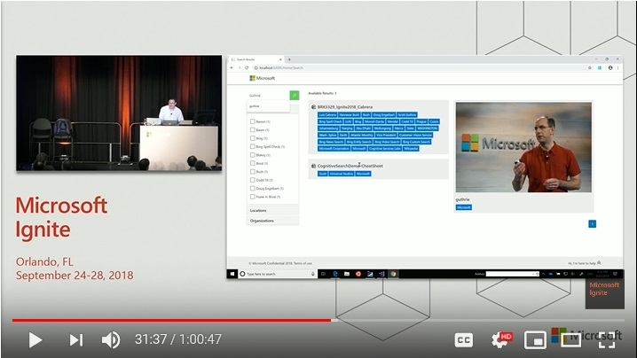

# Getting Started: Cognitive Search Front End Template

The source code here is for the front-end of a website used to navigate an Azure Search index. The goal of this front-end is to quickly allow you to navigate enrichments produced by a [Cognitive Search](https://docs.microsoft.com/en-us/azure/search/cognitive-search-concept-intro) flow. 

This website was demoed at Ignite 2018. You can see the demo in this [video (Starts at 21:40)](http://www.youtube.com/watch?v=Wh5Dt8wnEhg&t=21m40s).
 

## 1. Pre-requisites and related resources

If you do not already have a search index to back this front-end application you will need to upload the files you want to index to blob storage and then create an Azure Search index that will allow you to search the files. You can learn how to do this by reading this [quick-start](https://docs.microsoft.com/en-us/azure/search/cognitive-search-quickstart-blob).

## 2. Special Considerations

The demo front-end makes a few assumptions. You may want to follow those assumptions or adapt the code accordingly.

### 2.1 The Files in the Blob Storage should be accessible to the application

Since we actually want to be able to visualize the search results, the files need to be accessible to the application.

In order to do that you will need to update the following fields in [appsettings.json](CognitiveSearch.UI/appsettings.json):

### 2.2 Expectations on the Search Index

It is critical that you set the right search field properties as described in the table below if you want the front end code to work without a hitch.

| Field  | Notes and expectations |
|--|--|
|**content**| Used to show the transcript of the files. Should be **searchable and retrievable**.|
|**metadata_storage_path** | This should be the **key field**, and **base64 encoded**. (this is the default when you go through the "Import Data" workflow.)   The storage path is used to query the blob indexer for the content so that you can "preview" the file. Should be **retrievable**. |
|**metadata_storage_name** | Used to show the titles of the items in the result page. Should be **searchable and retrievable**.  |
|**people** | List of strings with the persons identified in the document. Should be **facetable, filterable, searchable and retrievable**. |
|**locations** |  List of strings with the locations identified in the document. Should be **facetable, filterable, searchable and retrievable**.|
|**organizations** | List of strings with the organizations identified in the document. Should be **facetable, filterable, searchable and retrievable**. |
| **keyPhrases** | List of key phrases identified in the document. Should be **facetable, filterable, searchable and retrievable**.|

To modify the fields you expect, take a look at the [SearchModel.cs](./CognitiveSearch.UI/Search/SearchModel.cs)  file.

**Facets** - Defines which facetable fields will show up as selectable filters in the UI. By default includes all facetable fields.

**Tags** - Defines which fields will be added to the Results card and details view as buttons. By default includes all facetable fields.

**ResultFields** - Defines which fields will be returned in the results view. Only fields that are used for the UI should be included here to reduce latency caused by larger documents. By default includes all fields.

## Known Issues That We Should Fix

1. The version of the Office file viewer we use does not show larger files. Pull requests welcome. :-) 

## Additional Resources
- [What is Cognitive Search?](https://docs.microsoft.com/en-us/azure/search/cognitive-search-concept-intro)
- [Cognitive Search Quickstart](https://docs.microsoft.com/en-us/azure/search/cognitive-search-quickstart-blob)
- [Cognitive Search REST APIs](https://docs.microsoft.com/en-us/azure/search/cognitive-search-tutorial-blob)
- [Azure ML](https://azure.microsoft.com/en-us/services/machine-learning-services/)

## Special thanks
Special thanks to Lauren Mills and Erika Menezes who wrote a large majority of the code here.  

## License
Copyright (c) Microsoft Corporation

All rights reserved.

MIT License

Permission is hereby granted, free of charge, to any person obtaining a copy of this software and associated documentation files (the ""Software""), to deal in the Software without restriction, including without limitation the rights to use, copy, modify, merge, publish, distribute, sublicense, and/or sell copies of the Software, and to permit persons to whom the Software is furnished to do so, subject to the following conditions:

The above copyright notice and this permission notice shall be included in all copies or substantial portions of the Software.

THE SOFTWARE IS PROVIDED AS IS, WITHOUT WARRANTY OF ANY KIND, EXPRESS OR IMPLIED, INCLUDING BUT NOT LIMITED TO THE WARRANTIES OF MERCHANTABILITY, FITNESS FOR A PARTICULAR PURPOSE AND NONINFRINGEMENT. IN NO EVENT SHALL THE AUTHORS OR COPYRIGHT HOLDERS BE LIABLE FOR ANY CLAIM, DAMAGES OR OTHER LIABILITY, WHETHER IN AN ACTION OF CONTRACT, TORT OR OTHERWISE, ARISING FROM, OUT OF OR IN CONNECTION WITH THE SOFTWARE OR THE USE OR OTHER DEALINGS IN THE SOFTWARE.
